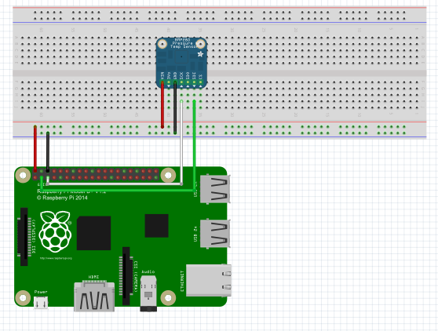

# BuildAzure.IoT.Adafruit.BME280
An Adafruit BME280 (Pressure, Temp &amp; Humidity) Sensor library for Windows IoT Core

### Wiring Diagram
Here's a simple Fritzing diagram that shows the expected wiring of the Adafruit BME280 sensor with a Raspberry Pi 2 or 3:

### Origins
This code was originally posted as part of the [Weather Station V 2.0 project](https://www.hackster.io/windows-iot/weather-station-v-2-0-8abe16) on [hackster.io](http://hackster.io). Since that project wasn't released using any reusable Nuget libraries for working with the Adafruit BME280 sensor, this project was created to borrow the BME280 code and release that out as a Nuget package for others to consume. Thankfully it's all licensed under the MIT License, and so is this project!
